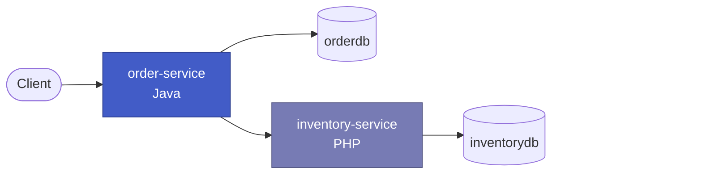
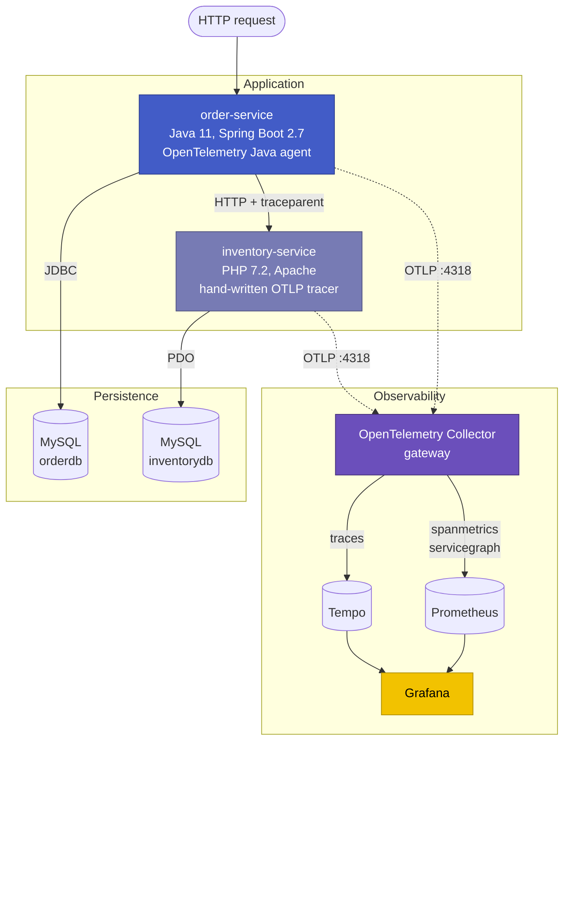
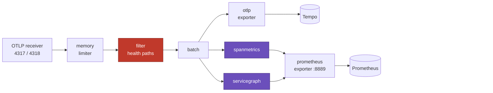
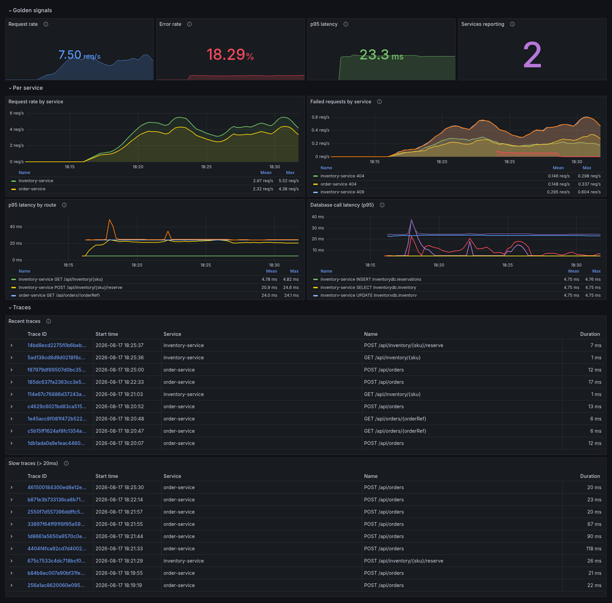
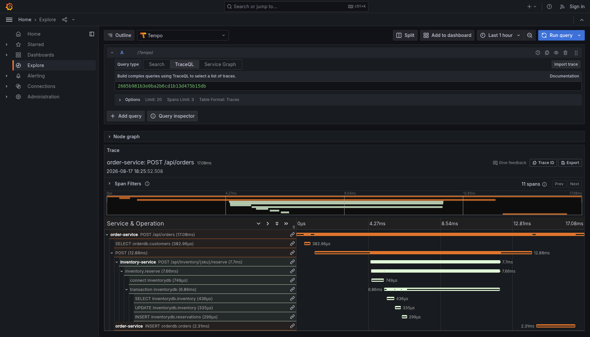
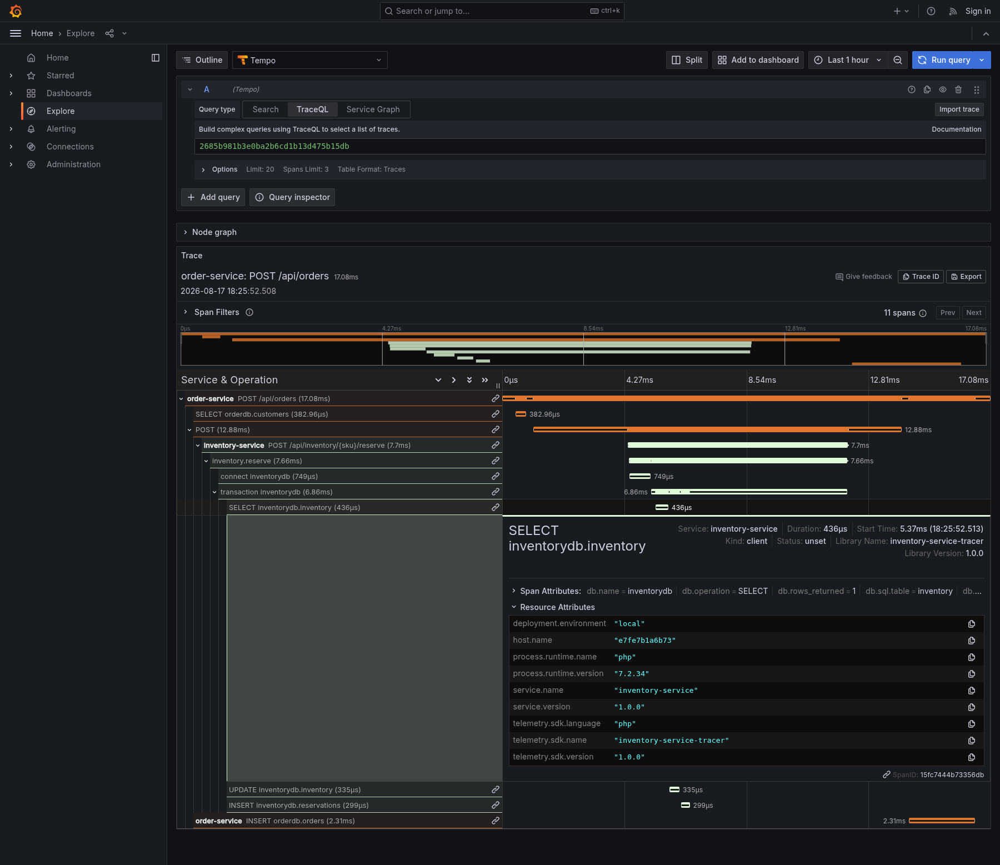
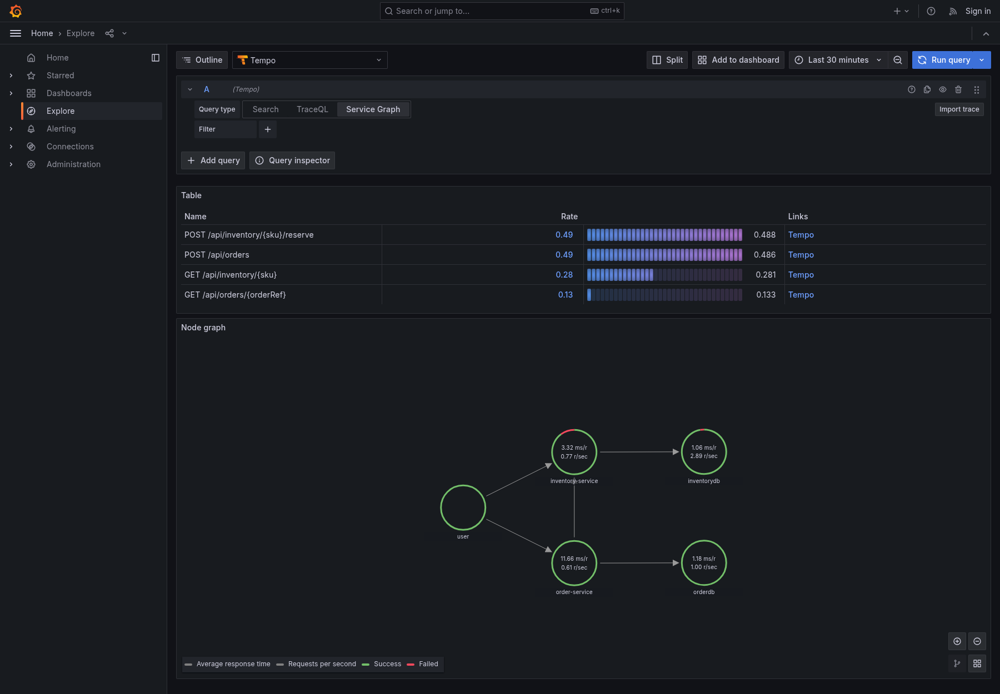
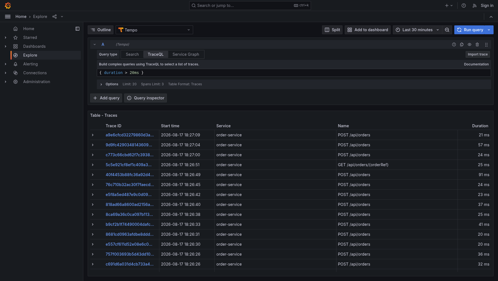
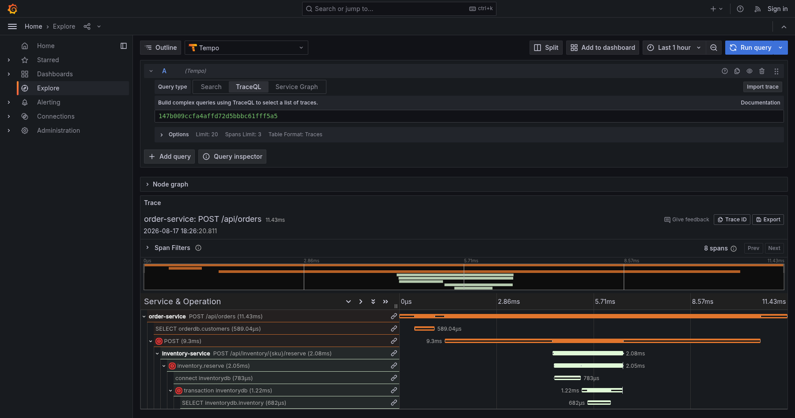

<h1 align="center">Production-Grade Distributed Tracing</h1>

<p align="center">
  <b>OpenTelemetry &nbsp;|&nbsp; Collector &nbsp;|&nbsp; Grafana Tempo &nbsp;|&nbsp; Prometheus &nbsp;|&nbsp; Grafana</b>
</p>

<p align="center">
  
  
  
  
  
  
</p>

<p align="center">
  A centralized tracing platform, plus two microservices on deliberately different stacks.<br>
  A Java service and a PHP service call each other, both talk to MySQL,<br>
  and one request becomes <b>one trace</b>.
</p>

---

## Contents

| | Section | | Section |
| :---: | --- | :---: | --- |
| 1 | [Overview](#1-overview) | 8 | [Running the Stack](#8-running-the-stack) |
| 2 | [Architecture](#2-architecture) | 9 | [API Reference](#9-api-reference) |
| 3 | [Technology](#3-technology) | 10 | [Screenshots](#10-screenshots) |
| 4 | [Project Structure](#4-project-structure) | 11 | [Verified Results](#11-verified-results) |
| 5 | [The Two Services](#5-the-two-services) | 12 | [Engineering Notes](#12-engineering-notes) |
| 6 | [How Tracing Works](#6-how-tracing-works) | 13 | [Production Hardening](#13-production-hardening) |
| 7 | [Design Decisions](#7-design-decisions) | 14 | [Troubleshooting](#14-troubleshooting) |

---

## 1. Overview

A request entering this system crosses two languages and two databases, and comes out as
a single trace you can read top to bottom.



### The problem it solves

When one request crosses several services, logs stop being enough. They cannot tell you
where the time went, which service failed, or what the request path actually was.

The harder version of that problem is coverage. Observability tooling targets current
runtimes, but real systems contain services older than the tooling. A platform that
cannot include them leaves blind spots exactly where incidents start.

This project answers that directly: `inventory-service` runs on **PHP 7.2**, which the
official OpenTelemetry SDK does not support at any version, and it still produces spans
that sit in the same trace as the Java service and look identical in Grafana.

### What it shows

| Area | Detail |
| --- | --- |
| Instrumentation | Two opposite approaches, zero-code and hand-written, producing interchangeable output |
| Propagation | W3C Trace Context (`traceparent`), the vendor-neutral standard |
| Runtime coverage | Includes an end-of-life runtime with no SDK |
| Metrics | Rate, errors and duration derived from spans, so a service with no metrics endpoint is still measurable |
| Correlation | Metric spike to trace, and trace back to metrics |
| Deployment | One `docker-compose up`, seven containers, fully provisioned |

---

## 2. Architecture



Three commitments make this work:

1. **OTLP is a wire format, not a library.** Anything that can send an HTTP POST with a
   JSON body can join. That is how PHP 7.2 participates.
2. **The Collector is a gateway.** Services know one address. Filtering, metric
   derivation and backend routing are centralized, so the storage backend can change
   without redeploying an application.
3. **Both services use the same attribute names**, so one dashboard query covers both.

### The two services, side by side

Instrumented by opposite methods on purpose, to show the platform does not care how spans
were produced.

| | order-service | inventory-service |
| --- | --- | --- |
| Runtime | Java 11 (Temurin) | PHP 7.2.24 |
| Framework | Spring Boot 2.7.18 | Apache with mod_php |
| Instrumentation | OpenTelemetry Java agent 2.10 | About 450 lines written by hand |
| Tracing code in source | **None** | `src/Tracing/` |
| Metrics endpoint | `/actuator/prometheus` | **None**, metrics come from spans |
| Role in the trace | Starts it | Continues it |

---

## 3. Technology

| Layer | Component | Version | Purpose |
| --- | --- | --- | --- |
| Application | Java | 11 (Temurin, jammy) | order-service runtime |
| | Spring Boot | 2.7.18 | Last line supporting Java 11 |
| | PHP | 7.2.24 | inventory-service runtime |
| | Apache | 2.4, mod_php | Hosts the PHP service |
| | MySQL | 8.0 | Persistence for both services |
| Instrumentation | OpenTelemetry Java Agent | 2.10.0 | Zero-code auto-instrumentation |
| | Custom OTLP tracer | 1.0.0 | PHP 7.2 instrumentation |
| Telemetry | Collector (contrib) | 0.111.0 | Gateway, filtering, metric derivation |
| | Grafana Tempo | 2.4.1 | Trace storage and TraceQL |
| | Prometheus | 2.54.1 | Metrics with exemplars |
| | Grafana | 10.4.2 | Dashboards and trace views |
| Platform | Docker Compose | v2 | Orchestration |

> The **contrib** Collector build is required. The `spanmetrics` and `servicegraph`
> connectors do not exist in the core distribution.

---

## 4. Project Structure

Every component owns its code, Dockerfile, config and compose file in one folder. The
root `compose.yaml` only composes them, so a component can be moved or extracted without
hunting for pieces elsewhere.

| Path | Owns | Rule |
| --- | --- | --- |
| `micro-services/<name>/` | One deployable service | Nothing about a service lives outside its folder |
| `infrastructure/mysql/` | Shared stateful dependency | A service never reaches in to change the schema |
| `tracing/` | The observability stack | No application code, no service names in its config |
| `compose.yaml` | Composition only | Defines no services of its own |
| `scripts/` | Load generation and screenshot capture | Not required to run the stack |

<details>
<summary><b>Full directory layout</b></summary>

```text
.
├── compose.yaml                      root, includes the four components
├── .env.example                      copy to .env and fill in
│
├── micro-services/
│   ├── order-service/                Java 11, Spring Boot 2.7
│   │   ├── compose.yaml
│   │   ├── Dockerfile                multi-stage build, attaches the agent
│   │   ├── pom.xml
│   │   └── src/main/java/com/tracing/order/
│   │       ├── client/               outbound call to the PHP service
│   │       ├── config/               RestTemplate and properties
│   │       ├── exception/
│   │       ├── model/
│   │       ├── repository/           JdbcTemplate, plain SQL
│   │       ├── service/
│   │       └── web/                  controller and error mapping
│   │
│   └── inventory-service/            PHP 7.2, Apache
│       ├── compose.yaml
│       ├── Dockerfile
│       ├── bootstrap.php             PSR-4 autoloader, no Composer needed
│       ├── public/index.php          front controller
│       └── src/
│           ├── Controller/
│           ├── Db/Database.php       PDO wrapper that emits spans
│           ├── Domain/
│           ├── Http/Router.php       route templates
│           ├── Repository/
│           └── Tracing/              the hand-written tracer
│               ├── TraceContext.php  reads the traceparent header
│               ├── Span.php
│               ├── Tracer.php        span lifecycle and flushing
│               └── OtlpHttpExporter.php
│
├── infrastructure/mysql/
│   ├── compose.yaml
│   └── init/01-schema.sql            databases, users, tables, seed rows
│
├── tracing/
│   ├── compose.yaml                  tempo, collector, prometheus, grafana
│   ├── collector/config.yaml
│   ├── tempo/tempo.yaml
│   ├── prometheus/prometheus.yml
│   └── grafana/provisioning/         datasources and the dashboard
│
├── scripts/
│   ├── generate-traffic.sh
│   └── capture-screenshots.sh
│
└── docs/screenshots/
```

</details>

The root file uses the Compose `include` directive, so each component file stands on its
own. `tracing/` and `infrastructure/mysql/` can run entirely alone:

```bash
docker-compose -f tracing/compose.yaml --env-file .env up -d
```

The two services cannot, because each declares `depends_on` against `mysql` and
`otel-collector`, and Compose rejects a project referencing services it cannot see. That
is the right trade: the dependency is real, and declaring it is what gives health-gated
startup ordering. Run them from the root file instead.

> Each `include` sets `env_file: .env` explicitly. An included compose file resolves
> variables against its own directory, so without that line every `${VAR}` would silently
> resolve to empty, passwords included.

---

## 5. The Two Services

### order-service (Java)

Entry point, and the service that starts every trace. Owns `orderdb`.

| Method | Endpoint | Flow |
| --- | --- | --- |
| `POST` | `/api/orders` | Look up customer, reserve stock remotely, write the order |
| `GET` | `/api/orders/{orderRef}` | Read the order, enrich with live stock |

There is **no tracing code in this service**. The agent is attached at container start
and configured entirely through `OTEL_*` environment variables. It instruments the
servlet container, `RestTemplate` and the JDBC driver by itself, and injects `trace_id`
into the logging context.

`JdbcTemplate` with plain SQL is used instead of JPA, so the query appearing as
`db.statement` in the trace is exactly the query written in the repository.

Status codes matter for tracing, because the agent derives span status from the response:

| Condition | Status | Span status |
| --- | :---: | --- |
| Validation failure | `400` | unset |
| Customer or order not found | `404` | unset |
| Insufficient stock, from PHP | `409` | unset |
| inventory-service unreachable | `503` | **error** |
| Unhandled exception | `500` | **error** |

### inventory-service (PHP)

Downstream service. Owns `inventorydb`.

| Method | Endpoint | Flow |
| --- | --- | --- |
| `GET` | `/api/inventory/{sku}` | Return stock levels |
| `POST` | `/api/inventory/{sku}/reserve` | Move stock to reserved, in a transaction |

**The constraint:** the official `opentelemetry-php` SDK requires PHP 8.0 or newer. This
runtime is 7.2.24. No supported library path exists, so the necessary subset of the
specification is implemented directly, in four files:

| File | Responsibility |
| --- | --- |
| `TraceContext.php` | Parse and validate the incoming `traceparent`, generate IDs |
| `Span.php` | Timings, attributes, status, exception events |
| `Tracer.php` | Span lifecycle, parent and child nesting, batch flush |
| `OtlpHttpExporter.php` | Serialize to OTLP JSON and POST to the Collector |

Spans are flushed from a `register_shutdown_function` handler, so they are still sent
when a fatal error ends the request early. Export is synchronous with a 500 ms connect
and 2 s total timeout: if the Collector is down you lose spans, never requests.

The response carries an `X-Trace-Id` header for direct lookup in Grafana.

### Data model

One MySQL instance, two databases, two users. Neither service can read the other's
tables, which is what forces the network call the trace exists to show.

| Database | Tables | Owner |
| --- | --- | --- |
| `orderdb` | `customers`, `orders` | `order_user` |
| `inventorydb` | `inventory`, `reservations` | `inventory_user` |

Seeded with 3 customers and 5 SKUs. **`SKU-1004` holds only 3 units on purpose**, so an
oversized order produces a real cross-service failure whenever you want one.

---

## 6. How Tracing Works

### Continuing the trace across the boundary

`order-service` sends a `traceparent` header on its outbound call. Reusing that trace id
is the entire mechanism that joins the two services.

```
traceparent: 00-4bf92f3577b34da6a3ce929d0e0e4736-00f067aa0ba902b7-01
```

| Field | Value | Meaning |
| --- | --- | --- |
| Version | `00` | Format version |
| Trace id | `4bf92f35 ... 0e4736` | 16 bytes. **Reused by the PHP service**, which is what makes one trace |
| Parent span id | `00f067aa0ba902b7` | 8 bytes, the caller's span |
| Flags | `01` | Sampled |

Without it the PHP spans would form a separate, orphaned trace and the request would look
like two unrelated operations. A missing or malformed header is ignored and a new trace
started, because instrumentation must never fail a request.

### Collector pipeline



| Stage | Setting | Reason |
| --- | --- | --- |
| `memory_limiter` | 512 MiB, 128 MiB spike | Shed load rather than run out of memory |
| `filter` | Drops `/actuator/health`, `/actuator/prometheus`, `/health` | Runs **before** the connectors, so probes pollute neither storage nor metrics |
| `batch` | 1 s or 1024 spans | Amortizes export cost |
| `spanmetrics` | 5 ms to 10 s buckets, exemplars on | The only source of metrics for the PHP service |
| `servicegraph` | 10 s store TTL | Matches client to server spans to build the dependency map |
| `prometheus` exporter | OpenMetrics, resource conversion | OpenMetrics is required for exemplars to survive the scrape |

Prometheus runs with `--enable-feature=exemplar-storage`. Without it, metric-to-trace
navigation does not work.

### Anatomy of one trace

A single `POST /api/orders` produces **11 spans across 2 services and 2 databases**:

| Span | Service | Kind | Duration |
| --- | --- | :---: | ---: |
| `POST /api/orders` | order-service | SERVER | 20.65 ms |
| &nbsp;&nbsp;&nbsp;`SELECT orderdb.customers` | order-service | CLIENT | 0.68 ms |
| &nbsp;&nbsp;&nbsp;`POST` | order-service | CLIENT | 11.72 ms |
| &nbsp;&nbsp;&nbsp;&nbsp;&nbsp;&nbsp;`POST /api/inventory/{sku}/reserve` | **inventory-service** | SERVER | 5.92 ms |
| &nbsp;&nbsp;&nbsp;&nbsp;&nbsp;&nbsp;&nbsp;&nbsp;&nbsp;`inventory.reserve` | inventory-service | INTERNAL | 5.86 ms |
| &nbsp;&nbsp;&nbsp;&nbsp;&nbsp;&nbsp;&nbsp;&nbsp;&nbsp;&nbsp;&nbsp;&nbsp;`connect inventorydb` | inventory-service | CLIENT | 1.44 ms |
| &nbsp;&nbsp;&nbsp;&nbsp;&nbsp;&nbsp;&nbsp;&nbsp;&nbsp;&nbsp;&nbsp;&nbsp;`transaction inventorydb` | inventory-service | CLIENT | 4.35 ms |
| &nbsp;&nbsp;&nbsp;&nbsp;&nbsp;&nbsp;&nbsp;&nbsp;&nbsp;&nbsp;&nbsp;&nbsp;&nbsp;&nbsp;&nbsp;`SELECT inventorydb.inventory` | inventory-service | CLIENT | 0.55 ms |
| &nbsp;&nbsp;&nbsp;&nbsp;&nbsp;&nbsp;&nbsp;&nbsp;&nbsp;&nbsp;&nbsp;&nbsp;&nbsp;&nbsp;&nbsp;`UPDATE inventorydb.inventory` | inventory-service | CLIENT | 0.48 ms |
| &nbsp;&nbsp;&nbsp;&nbsp;&nbsp;&nbsp;&nbsp;&nbsp;&nbsp;&nbsp;&nbsp;&nbsp;&nbsp;&nbsp;&nbsp;`INSERT inventorydb.reservations` | inventory-service | CLIENT | 0.39 ms |
| &nbsp;&nbsp;&nbsp;`INSERT orderdb.orders` | order-service | CLIENT | 2.57 ms |

What this shows:

- The PHP spans are **children of a Java span**. One trace, two runtimes, joined only by
  an HTTP header.
- Auto-instrumented and hand-written spans interleave and are indistinguishable.
- Database work is attributed per service, with the parameterized SQL on `db.statement`.
- The explicit `transaction` span makes the lock window measurable rather than implied.

### What you can do with it

| Capability | Mechanism | Use |
| --- | --- | --- |
| Trace search | Tempo, TraceQL | `{ resource.service.name = "order-service" && duration > 250ms }` |
| RED metrics per service | `spanmetrics` | Rate, errors, duration, including for PHP |
| Latency per route | `http.route` label | See which endpoint regressed |
| Database latency | Client span metrics | Separate slow queries from slow application code |
| Dependency map | `servicegraph` | `order-service` to `inventory-service` to `mysql` |
| Metric to trace | Prometheus exemplars | Click a spike, open the trace behind it |
| Trace to metric | `tracesToMetrics` | From a span, see its rate and latency context |
| Log to trace | `trace_id` in the log pattern | Go from a log line to the whole request |

---

## 7. Design Decisions

Deliberate choices, not defaults.

| # | Practice | Why it matters |
| :---: | --- | --- |
| 1 | Collector as a gateway | The backend can be swapped without touching application code |
| 2 | Health traffic filtered out | Probes every 10 s would otherwise flood traces and distort metrics |
| 3 | Route templates, not raw paths | `/api/inventory/{sku}` keeps cardinality bounded; raw paths would create a series per SKU |
| 4 | Stable semantic conventions | Dashboards and alerts work across both services with no translation |
| 5 | Only 5xx marks a span failed | A 404 is a caller mistake, not a service failure; mixing them makes error alerts useless |
| 6 | Tracing degrades safely | Tight exporter timeouts, errors swallowed: a Collector outage must not become an application outage |
| 7 | Metrics derived from spans | A runtime with no metrics endpoint still gets rate, errors and latency |
| 8 | Exemplars both ways | Click a latency spike and land on the trace that caused it |
| 9 | Separate database per service | Forces the network call the trace exists to show, and prevents hidden coupling |
| 10 | Prepared statements everywhere | `db.statement` shows the real parameterized SQL, and there is no injection surface |
| 11 | `SELECT ... FOR UPDATE` before mutating stock | Two orders for the last item cannot both succeed |
| 12 | Every image version-pinned | `:latest` changed behaviour mid-project and broke dashboard loading |
| 13 | `trace_id` in the log pattern | Any log line can be traced back to the request that produced it |
| 14 | Health-gated startup ordering | No race between schema initialization and application boot |

---

## 8. Running the Stack

### Requirements

Docker and Docker Compose v2. Java, Maven and PHP are **not** needed on the host: both
services build inside containers.

### First run

`.env` holds the passwords and is deliberately not in git, so create it first:

```bash
cp .env.example .env
```

Edit it and replace every `changeme`. The two database passwords must match the users in
`infrastructure/mysql/init/01-schema.sql`.

> Skipping this does not fail loudly. Compose only warns about unset variables, then
> starts MySQL with an empty root password and fails later in a confusing way.

Then, from the repository root:

```bash
docker-compose up -d --build
```

The first build downloads the Spring Boot dependencies, the Java agent and the base
images, so it takes a few minutes. After that it is quick. Wait until `order-service`
and `inventory-service` report `healthy`.

### Daily commands

| Action | Command |
| --- | --- |
| Start | `docker-compose up -d` |
| Start with rebuild | `docker-compose up -d --build` |
| Status | `docker-compose ps` |
| Logs | `docker-compose logs -f order-service inventory-service` |
| Restart one service | `docker-compose restart inventory-service` |
| Rebuild one service | `docker-compose up -d --build order-service` |
| Stop, keep data | `docker-compose down` |
| Stop and wipe volumes | `docker-compose down -v` |

### Endpoints

| Service | URL | Note |
| --- | --- | --- |
| Grafana | http://localhost:3000 | Dashboards and trace search |
| Prometheus | http://localhost:9090 | Metric queries |
| Tempo | http://localhost:3200 | Trace API |
| order-service | http://localhost:8080 | Java API |
| inventory-service | http://localhost:8081 | PHP API |
| MySQL | `localhost:3307` | 3306 inside the network; 3307 avoids a host MySQL |
| Collector OTLP | `4318` HTTP, `4317` gRPC | |

Grafana credentials come from `.env`. Anonymous access is enabled with the Admin role, so
the login screen can be skipped while presenting.

---

## 9. API Reference

### Place an order

Produces the full two-service trace.

```bash
curl -s -X POST http://localhost:8080/api/orders \
  -H 'Content-Type: application/json' \
  -d '{"customerId": 1, "sku": "SKU-1001", "quantity": 2}'
```

```json
{
  "orderRef": "ORD-560A513C",
  "customerName": "Ayesha Rahman",
  "sku": "SKU-1001",
  "productName": "Mechanical Keyboard 87-key",
  "quantity": 2,
  "totalAmount": 178.00,
  "status": "CONFIRMED",
  "availableQty": 118
}
```

### Other calls

| Purpose | Command |
| --- | --- |
| Read an order back | `curl -s http://localhost:8080/api/orders/ORD-560A513C` |
| Stock for one SKU | `curl -s -i http://localhost:8081/api/inventory/SKU-1003` |
| Reserve directly | `curl -s -X POST http://localhost:8081/api/inventory/SKU-1001/reserve -H 'Content-Type: application/json' -d '{"orderRef":"ORD-MANUAL1","quantity":1}'` |

Calling the PHP service directly starts its own trace, because no `traceparent` arrives.
The response includes an `X-Trace-Id` header you can paste into Grafana.

### Produce a failure trace

`SKU-1004` holds 3 units, so this returns `409` and shows the error crossing the service
boundary:

```bash
curl -s -i -X POST http://localhost:8080/api/orders \
  -H 'Content-Type: application/json' \
  -d '{"customerId": 2, "sku": "SKU-1004", "quantity": 999}'
```

### Generate traffic

The dashboard panels use `rate()` over a 5 minute window, so they need continuous traffic
before they show anything meaningful.

```bash
./scripts/generate-traffic.sh                      # 15 minutes at about 4 req/s
DURATION=1800 RPS=6 ./scripts/generate-traffic.sh  # longer and busier
WITH_OUTAGE=1 ./scripts/generate-traffic.sh        # adds a real 5xx incident
```

Load moves through nine phases on a cycle, from `quiet` at 0.25x to `spike` at 3.6x, with
per-request jitter, so the graphs show a realistic shape instead of a flat line.

`WITH_OUTAGE=1` stops inventory-service for 25 seconds midway. order-service then returns
503, which is the only way to get genuine `STATUS_CODE_ERROR` server spans, because 4xx
deliberately does not mark a span as an error.

---

## 10. Screenshots

Captured from the running stack with headless Chrome:

```bash
./scripts/generate-traffic.sh &     # start traffic
sleep 90                            # let the rate window fill
./scripts/capture-screenshots.sh
```

<details open>
<summary><b>Distributed Tracing Overview dashboard</b></summary>
<p align="center">
  
</p>
</details>

<details>
<summary><b>Trace waterfall across Java and PHP</b></summary>
<p align="center">
  
</p>
</details>

<details>
<summary><b>Span detail, database attributes from the PHP tracer</b></summary>
<p align="center">
  
</p>
</details>

<details>
<summary><b>Service dependency graph</b></summary>
<p align="center">
  
</p>
</details>

<details>
<summary><b>TraceQL search</b></summary>
<p align="center">
  
</p>
</details>

<details>
<summary><b>Error trace, 409 crossing the boundary</b></summary>
<p align="center">
  
</p>
</details>

---

## 11. Verified Results

Captured from the running stack, not illustrative.

**Load:** 4,283 requests over 900 s. 2,571 to order-service (1,933 created, 404 conflicts,
210 not-found, 24 genuine 5xx) and 1,094 direct to inventory-service.

**Metrics derived from spans**, including for the service that exposes no metrics
endpoint at all:

| Service | Server spans | Client spans | Internal spans |
| --- | ---: | ---: | ---: |
| order-service | 33 | 92 | 0 |
| inventory-service | 34 | 152 | 32 |

**Dependency map:**

| Client | Server | Type |
| --- | --- | --- |
| order-service | inventory-service | direct |
| order-service | orderdb | database |
| inventory-service | inventorydb | database |

**Functional tests:**

| Scenario | Expected | Result |
| --- | --- | :---: |
| Place an order | `201`, stock 120 to 118 | Pass |
| Read the order back | `200` with live stock | Pass |
| Order more than available | `409` from PHP through Java | Pass |
| Call PHP directly | `200`, `X-Trace-Id`, new trace | Pass |
| Trace continuity | PHP spans nested under Java | Pass |
| Span status agreement | Both leave 2xx unset | Pass |
| Dashboard provisioning | 10 panels, 2 datasources | Pass |

---

## 12. Engineering Notes

Real problems from building this. Most fail silently, which is why they are written down.

<details>
<summary><b>Wrong OTLP protocol throws away every span</b></summary>

The Java agent defaults to gRPC. Point it at port 4318, which is HTTP, and it sends gRPC
frames to an HTTP endpoint: every span is dropped and nothing reports an error.

Always set `OTEL_EXPORTER_OTLP_PROTOCOL=http/protobuf` with port 4318, or use 4317 and
leave the default. This is the most common OpenTelemetry misconfiguration there is.
</details>

<details>
<summary><b>The two services disagreed on span status</b></summary>

inventory-service reported `STATUS_CODE_OK` on success while order-service reported
`STATUS_CODE_UNSET`. The PHP tracer was setting OK on 2xx, but the HTTP conventions
require status to be left unset for 1xx, 2xx and 3xx; OK is reserved for an explicit
application override.

Any metric query grouped by `status_code` would have split across two label values and
undercounted both services. PHP now leaves 2xx unset, matching the agent exactly.
</details>

<details>
<summary><b>An unpinned Grafana image broke dashboard provisioning</b></summary>

Grafana reported healthy while serving a stale dashboard. The only clue was in its log:

```
failed to save dashboard ... deprecatedInternalID=... is already in use
```

`grafana/grafana:latest` now resolves to Grafana 12, whose rewritten dashboard API
refuses to save a provisioned dashboard when an older one in a persisted volume holds the
same internal id. Pinned to `10.4.2`, which matches the dashboard `schemaVersion`. Every
image in the stack is pinned now.
</details>

<details>
<summary><b>MySQL 8 authentication does not work with PHP 7.2</b></summary>

`The server requested authentication method unknown to the client`. MySQL 8 defaults to
`caching_sha2_password` and the mysqlnd driver in PHP 7.2 cannot negotiate it.

Start the server with `--default-authentication-plugin=mysql_native_password` and create
users with an explicit `IDENTIFIED WITH mysql_native_password` clause.
</details>

<details>
<summary><b>Debian Buster reached end of life</b></summary>

`apt-get update` returns 404 inside both `php:7.2-apache` and `openjdk:11-jre-slim`,
because both are built on Buster and its repositories have been retired.

The PHP image installs nothing through apt, and its health check uses PHP's own curl
extension instead of the binary. The Java runtime moved to `eclipse-temurin:11-jre-jammy`.
</details>

<details>
<summary><b>Spring Boot no longer manages the old MySQL driver</b></summary>

Boot 2.7.8 followed MySQL's rename and dropped `mysql:mysql-connector-java` from its
managed dependencies, so on 2.7.18 the old coordinates inherit no version and the build
fails before it starts. Use `com.mysql:mysql-connector-j`; the driver class is unchanged.
</details>

<details>
<summary><b>PDO rejects a repeated named parameter</b></summary>

With `ATTR_EMULATE_PREPARES => false`, PDO rewrites named parameters to positional ones
and cannot bind the same name twice, giving `SQLSTATE[HY093]`. Use two placeholder names
for the same value:

```sql
UPDATE inventory
   SET available_qty = available_qty - :taken,
       reserved_qty  = reserved_qty  + :held
 WHERE sku = :sku
```
</details>

<details>
<summary><b>Renaming the compose project orphaned its volumes</b></summary>

Compose refuses to reuse volumes labelled for a different project, and `docker-compose
down` under the new name cannot see the old resources. Run `docker-compose down -v`
**before** changing the project name.
</details>

---

## 13. Production Hardening

The architecture and instrumentation above are production-grade. The settings below are
**deliberately simplified for local use** and must change before a real deployment.

| # | Area | Current | Required |
| :---: | --- | --- | --- |
| 1 | Credentials | Plain text in `.env` and the schema | A secrets manager; never commit credentials |
| 2 | Transport security | `insecure: true` on OTLP, `useSSL=false` on JDBC | mTLS to the Collector, TLS to the database |
| 3 | Collector access | Open OTLP endpoint | Authenticator extension or network policy |
| 4 | Grafana access | Anonymous with Admin role | SSO, least-privilege roles, anonymous off |
| 5 | Trace storage | Local disk, 24 h, single instance | Object storage, replicated, retention by policy |
| 6 | Sampling | Everything traced | Tail-based sampling: keep all errors and slow traces, sample the rest |
| 7 | Collector availability | One instance | Agent tier plus a scaled gateway tier |
| 8 | Database auth | `mysql_native_password` | `caching_sha2_password` where the client supports it |
| 9 | Database privileges | `GRANT ALL` per database | Only the privileges each service needs |
| 10 | PHP export path | Synchronous, in-request | Local agent over a Unix socket, or async handoff |
| 11 | Sensitive data | Statement sanitizing only | A redaction policy over `db.statement` and HTTP attributes |
| 12 | Resource limits | Unbounded | CPU and memory limits, Collector queue sizing |
| 13 | Alerting | None | SLO alerts, plus Collector `refused_spans` and `dropped_spans` |
| 14 | PHP version | 7.2, end of life | Upgrade to a supported PHP and the official SDK |

---

## 14. Troubleshooting

<details>
<summary><b>No traces at all</b></summary>

```bash
docker-compose logs otel-collector | tail -50
curl -s http://localhost:8888/metrics | grep receiver_accepted_spans
```

If `otelcol_receiver_accepted_spans` is not increasing, the services are not reaching the
Collector. For Java the usual cause is the gRPC and HTTP protocol mismatch.
</details>

<details>
<summary><b>Java traces appear but PHP spans are missing</b></summary>

```bash
docker-compose logs inventory-service | grep '\[tracing\]'
```

The exporter logs failures through `error_log`, which Apache sends to container stderr.
</details>

<details>
<summary><b>Two separate traces instead of one</b></summary>

The `traceparent` header is not arriving. Confirm the agent is attached
(`docker-compose logs order-service | head -20` should mention `opentelemetry-javaagent`)
and that `OTEL_PROPAGATORS` includes `tracecontext`.
</details>

<details>
<summary><b>inventory-service cannot connect to MySQL</b></summary>

`The server requested authentication method unknown to the client` means the
`mysql_native_password` setting is missing. Recreate the volume so the init script runs
again: `docker-compose down -v && docker-compose up -d`.
</details>

<details>
<summary><b>Dashboard panels are empty</b></summary>

Span-derived metrics exist only after traffic, and the Collector flushes every 15 s. Run
`./scripts/generate-traffic.sh` and wait a moment.
</details>

<details>
<summary><b>Grafana shows an outdated dashboard</b></summary>

```bash
docker logs grafana 2>&1 | grep "failed to save dashboard"
```

On an internal id conflict, recreate the volume:

```bash
docker-compose stop grafana && docker-compose rm -f grafana
docker volume rm grafana_data && docker-compose up -d grafana
```
</details>

---

## Adding Another Service

Nothing in the Collector, Tempo or Grafana configuration is service-specific:

1. Point any OpenTelemetry SDK at `http://<collector-host>:4318`, or `:4317` for gRPC.
2. Set `OTEL_SERVICE_NAME`, and on HTTP also `OTEL_EXPORTER_OTLP_PROTOCOL=http/protobuf`.
3. Ensure `tracecontext` propagation is enabled.

The service then appears on its own in the traces, the dependency map, the metrics and
the dashboard.

| Stack | Approach |
| --- | --- |
| Java, Kotlin, Scala | Java agent, no code changes |
| Node.js | `@opentelemetry/auto-instrumentations-node` |
| Python | `opentelemetry-instrument` |
| Go | SDK with `otelhttp` middleware |
| .NET | `OpenTelemetry.Instrumentation.*` |
| PHP 8.0 and newer | Official `opentelemetry-php` SDK |
| **PHP older than 8.0** | **The tracer in this repository** |
| Frontend | `@opentelemetry/sdk-trace-web`, CORS on the Collector |

---

<p align="center">
  <sub>Observability is a protocol commitment, not a library dependency.<br>
  Anything that can make an HTTP request can take part, including the services that
  usually stay invisible.</sub>
</p>
